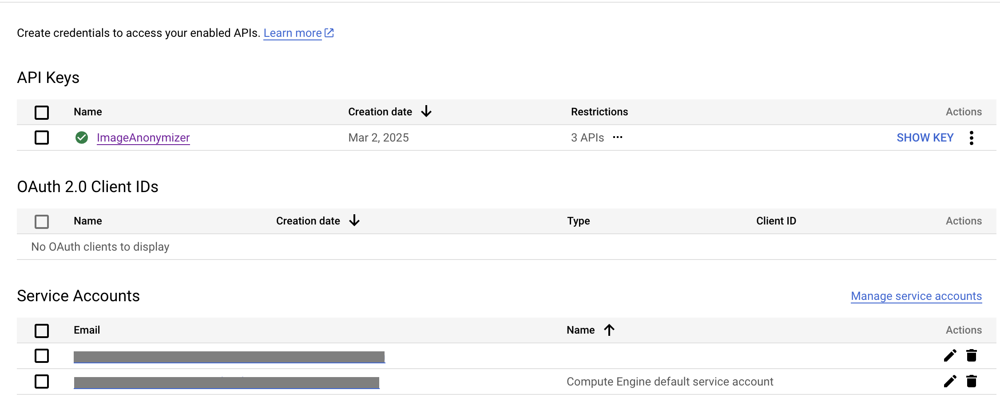
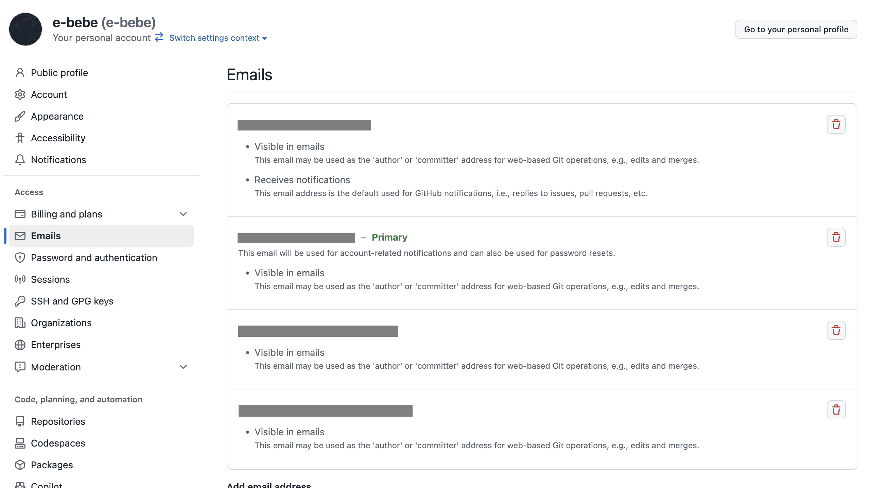

# Image Anonymizer
A command-line tool to detect and mask sensitive content in images.

## Features
- Detects and masks sensitive content in images:
  - Text detection via OCR
  - Face detection and masking
- Identifies sensitive textual information like:
  - API keys
  - Email addresses
  - Phone numbers
  - Credit card numbers
  - Personal names
  - Company or service names
- Masks detected content with colored rectangles
- Applies mosaic effect to faces to protect privacy
- Outputs processed images to a specified directory

## Installation
```
cargo install image-anonymizer
```

## Configuration
The application requires API keys to access Google Cloud Platform services. Create a `.env` file in the root directory based on the `.env.template` file:
```
# You need to set these environment variables
# GCP API Key for Google Cloud Platform need to access "Gemini for Google Cloud API", "Generative Language API" and "Cloud Vision API"
GCP_API_KEY=
GEMINI_MODEL=gemini-2.0-flash-lite
```
Fill in your GCP API key to enable text and face detection capabilities.

## Usage
```
image-anonymizer [OPTIONS] <INPUT_FILE>
Options:
  -o, --output-dir <DIR>     Output directory for processed images [default: ./output]
  -m, --mask-texts <TEXTS>   Additional texts to mask, comma separated
  -f, --mask-faces           Enable face detection and mosaic masking
  -h, --help                 Print help
  -V, --version              Print version
```

## Examples

### Text Masking

The tool can detect and mask sensitive text such as email addresses, API keys, and other personal information.

**Example 1**



**Example 2**



### Face Detection and Mosaic

The tool can automatically detect faces in images and apply a mosaic effect to protect privacy.

**Before:**


**After:**


### Command Examples

```bash
# Process a single image 
image-anonymizer screenshot.png

# Process an image and specify output directory
image-anonymizer --output-dir ./masked_images screenshot.png

# Process an image and mask additional text
image-anonymizer --mask-texts "secret,confidential" screenshot.png

# Process an image and apply mosaic to faces
image-anonymizer --mask-faces screenshot.png

# Process an image, mask both faces and specific text
image-anonymizer --mask-faces --mask-texts "confidential" screenshot.png
```

## Running Tests
```bash
# Run all tests excluding integration tests that require API keys
cargo test

# Run all tests including integration tests
# (requires valid API keys in .env)
cargo test -- --include-ignored

# Run specific test
cargo test test_mask_text_with_annotations

# Run tests with logging
RUST_LOG=debug cargo test
```

Note: Some tests require a valid GCP API key to be set in the environment or in a `.env` file. Tests that make API calls are marked as `#[ignore]` and can be run with the `--include-ignored` flag.

## License
This project is licensed under the MIT License - see the LICENSE file for details.
